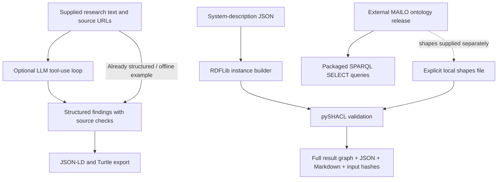

# MAILO Legal AI Engine

**Python-based AI research pipeline + knowledge engineering + validation.**

A small research prototype extracted and refactored from Victor Kao's private MAILO thesis tooling. It turns supplied research findings into RDF and runs explicit SHACL constraints against system descriptions. The optional research command uses an LLM tool loop to structure supplied text; the demo and validation commands run offline.

[MAILO ontology](https://github.com/vrkkao-eng/Mailo-ontology) owns the knowledge model and substantive shapes. This repository owns the Python application and tests. See [attribution](ATTRIBUTION.md) and the [extraction audit](PUBLICATION_AUDIT.md).

## Problem

A legal-AI workflow needs traceable sources, machine-readable outputs, and testable validation boundaries. Model output alone cannot show which source a finding came from or whether a structured system description satisfies explicit constraints. This engine makes those steps inspectable.

## Architecture



The finding graph and system-description validation are separate inputs. The engine does **not** automatically derive compliance assertions from LLM findings.

## CLI usage

Python 3.11+:

```bash
python -m venv .venv
# macOS/Linux
source .venv/bin/activate
# Windows PowerShell: .\.venv\Scripts\Activate.ps1
python -m pip install -e ".[dev,research]"
mailo --help
mailo demo --output artifacts/demo
```

The synthetic demo creates JSON-LD and Turtle findings, an instance graph, and SHACL reports in JSON, Turtle and Markdown. It requires no API key or live source. Packaged resources also work when installed from a wheel and run outside the checkout.

```bash
mailo graph --input mailo_cli/resources/findings.json --output artifacts/graph
mailo validate --instance mailo_cli/resources/system.json --shapes mailo_cli/resources/demo-shapes.ttl --output artifacts/validation
```

Exit status: 0 for success/conformance, 1 for nonconformance or a reported processing error, and 2 for command-line usage errors. Demo shapes are synthetic engineering examples, not legal rules.

For the public ontology, keep its release separate:

```bash
git clone --branch v5.2.3 --depth 1 https://github.com/vrkkao-eng/Mailo-ontology.git external/Mailo-ontology
mailo sparql --ontology external/Mailo-ontology/docs/ontology.ttl --built-in frameworks
mailo sparql --ontology external/Mailo-ontology/docs/ontology.ttl --built-in cjeu_chain
mailo validate --instance mailo_cli/resources/system.json --shapes external/Mailo-ontology/docs/mailo_shacl_shapes.ttl --output artifacts/mailo-validation
```

The deliberately minimal demo system can fail the substantive shapes. Read the report; conformance is always relative to the supplied shapes and their selected targets. Other query names: `tensions`, `obligations_samd`, `fto_patent`. Results preserve full RDF identifiers and numeric zero values. The inherited `obligations_samd` template returns zero rows against v5.2.3; it is not an implemented applicability/reasoning engine. Query execution evidence is in [verification](docs/verification.md).

Optional **live** research:

```bash
# Set ANTHROPIC_API_KEY and MAILO_MODEL in your shell, then:
mailo research --input mailo_cli/resources/findings.json --output artifacts/research
```

This sends the supplied text and source URLs to Anthropic and may incur charges. Select an available model through `MAILO_MODEL` or `--model`; no model is silently chosen. The public agent can only call `save_finding`; it cannot browse or read arbitrary local files. Only supplied source URLs are accepted. `.env.example` lists optional variables, but the program does not automatically load it.

## Validation and testing

```bash
python -m pytest -q
python tools/validate_examples.py
python -m build --wheel
```

Tests include adapted original BaseAgent/exporter tests and regression tests for source provenance, model/tool round trips, incomplete model responses, RDF escaping, strict JSON booleans, duplicate titles, full-content export, anonymous SHACL constraints, all three severity levels, CLI exit codes and all packaged queries. A test fixture rejects external socket connections and removes live credentials; loopback is allowed for Windows asyncio's internal socketpair.

GitHub Actions tests Python 3.11–3.13 and smoke-tests a built wheel outside the checkout. Model tests use mocks; they do not measure model quality. Input and shape SHA-256 hashes in each validation report identify the exact files checked. Every SHACL result is retained; no private code-to-legal-remedy mapping is needed.

## Knowledge engineering

- Canonical vocabulary namespace: `https://w3id.org/mailo#`.
- Finding categories map to RDF types, with source links and content preserved.
- Content-derived identifiers prevent different same-title findings from overwriting one another.
- System JSON uses explicit class names, strict booleans and linked oversight/explanation records.
- Missing assertions stay missing; the builder does not invent positive oversight flags.
- Reviewed SPARQL templates are packaged with the application.
- The runtime uses RDFLib and pySHACL; it does not rebuild or duplicate the canonical ontology.

## Limitations

This is a research prototype. There is no deployed service, vector database, retrieval benchmark, independent legal validation or production-readiness claim.

SHACL conformance is not legal correctness or a compliance decision. Constraints check asserted data and selected targets; an irrelevant target class can produce vacuous conformance. Only run trusted local shapes. The engine disables JavaScript, advanced rules and ontology imports, but shape/query resource exhaustion is not sandboxed.

The LLM can still misinterpret supplied text. A matching source URL proves provenance membership, not evidential support. Live provider compatibility and quality are not covered by mocked tests. The private project's specialist prompts, web-retrieval integrations and multi-agent orchestrator are not part of this release.

Category mappings are inherited application conventions; they do not establish that a finding is a court holding. The patent query juxtaposes cases and tensions without establishing a case-specific legal relationship, and is not a freedom-to-operate assessment. Ontology versions can change legal assertions and shapes independently of engine versions.

## Relation to MAILO ontology

| Repository | Owns |
| --- | --- |
| [Mailo-ontology](https://github.com/vrkkao-eng/Mailo-ontology) | Canonical RDF/OWL model, substantive SHACL shapes, legal-source annotations, releases; CC BY 4.0. |
| mailo-legal-ai-engine | CLI, optional research tool loop, input mapping, graph export, validation reports, SPARQL execution, tests; MIT. |

The public engine starts at **0.1.0** independently of the private CLI's 5.0.0 and ontology's 5.2.3. Ontology files remain external and retain their own licence. No private Git history was copied.

## Attribution and portfolio

Victor (Chang-Hua) Kao's original source declares MIT licensing and records Claude-assisted development. This extraction and its new tests/documentation were prepared with Codex assistance. See [ATTRIBUTION.md](ATTRIBUTION.md) for the file-level provenance and changed behavior.

The [portfolio note](docs/portfolio.md) gives a factual Netcompany/FDE framing and a small next-build roadmap.
