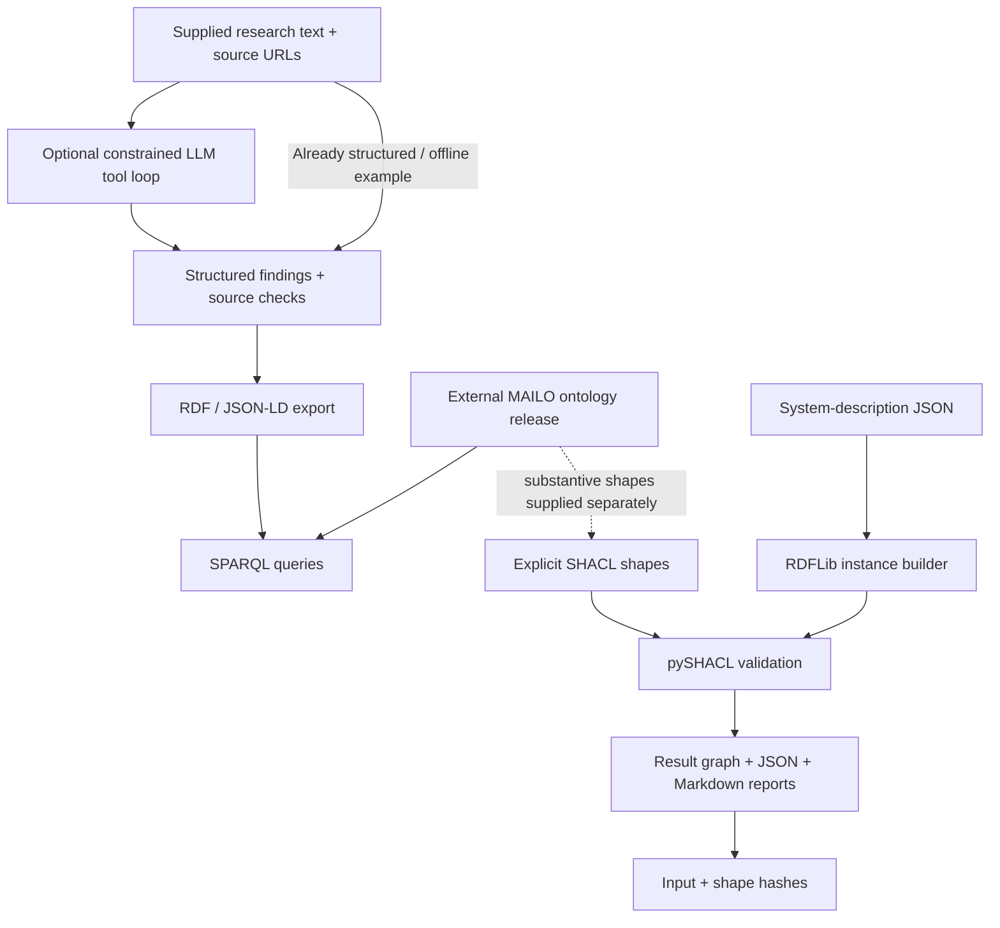

# MAILO Legal AI Engine

**Python application layer for traceable legal-AI workflows: structured findings → RDF/JSON-LD → SPARQL → SHACL validation.**

[](https://github.com/vrkkao-eng/mailo-legal-ai-engine/actions/workflows/tests.yml)


MAILO Legal AI Engine is a Python application layer for inspectable legal-AI workflows. It converts structured research findings into RDF/JSON-LD, executes reviewed SPARQL queries, validates structured system descriptions with SHACL, and produces reproducible reports. An optional constrained LLM tool loop can structure supplied source material.

The public engine was extracted and refactored from MAILO thesis tooling. The canonical ontology and substantive legal constraints remain in the separate [MAILO ontology repository](https://github.com/vrkkao-eng/Mailo-ontology).

## What this project demonstrates

| Area | Demonstrated evidence |
| --- | --- |
| **Python application engineering** | Packaged CLI, explicit exit codes, input validation, error handling, wheel build |
| **Knowledge engineering** | RDF/JSON-LD export, canonical MAILO namespace, reviewed SPARQL queries |
| **AI integration** | Optional Anthropic-backed tool loop with constrained source handling |
| **Validation** | RDFLib instance building, pySHACL execution, complete result retention, input/shape SHA-256 hashes |
| **Testing** | pytest regression coverage, mocked model interactions, network isolation |
| **CI** | GitHub Actions across Python 3.11–3.13, package build, clean-environment wheel smoke test |
| **Research transparency** | Explicit separation between legal source material, modelling choices, executable constraints, and system outputs |

## 60-second offline demo

No API key is required.

```bash
git clone https://github.com/vrkkao-eng/mailo-legal-ai-engine.git
cd mailo-legal-ai-engine

python -m venv .venv
# macOS/Linux
source .venv/bin/activate
# Windows PowerShell: .\.venv\Scripts\Activate.ps1

python -m pip install -e ".[dev]"
mailo demo --output artifacts/demo
```

The demo creates structured graph output and SHACL validation reports from synthetic inputs. It is designed to show the engineering path without relying on live providers or private research material.

Try the individual commands:

```bash
mailo graph \
  --input mailo_cli/resources/findings.json \
  --output artifacts/graph

mailo validate \
  --instance mailo_cli/resources/system.json \
  --shapes mailo_cli/resources/demo-shapes.ttl \
  --output artifacts/validation
```

## Architecture



The finding graph and system-description validation are deliberately separate inputs. The engine does **not** turn LLM output into an automatic legal-compliance conclusion.

## Implemented now vs next engineering increment

| Implemented now | Next engineering increment |
| --- | --- |
| Python package + CLI | API authentication and request limits |
| FastAPI service layer for offline graph, demo-shape validation, and reviewed SPARQL | Deployment and observability |
| RDF / JSON-LD export | Service configuration and deployment controls |
| Reviewed SPARQL execution | Vector retrieval / Qdrant |
| SHACL validation + structured reports | Retrieval evaluation set and metrics |
| Source-linked findings | Auth / request limits for service use |
| pytest regression tests | Deployment and observability |
| GitHub Actions CI, including container build and `/health` smoke test | Deployment pipeline |
| Docker API image and Compose configuration | Production service hardening |

The right-hand column is a roadmap, **not a claim of current implementation**.

## Why this problem matters

A legal-AI workflow needs more than a generated answer. It needs to expose:

- which source a finding came from;
- how structured knowledge was produced;
- which explicit constraint was checked;
- what data the check actually evaluated;
- what failed or conformed; and
- where legal interpretation still remains outside the executable layer.

This engine makes those boundaries inspectable instead of collapsing research, model output, and validation into one opaque “compliance” result.

## CLI

Python 3.11+.

```bash
mailo --help
```

Core commands:

| Command | Purpose |
| --- | --- |
| `mailo demo` | Run the bundled synthetic example offline |
| `mailo graph` | Export supplied findings to JSON-LD and Turtle |
| `mailo validate` | Validate a structured system description against explicit local SHACL shapes |
| `mailo sparql` | Run one of the reviewed packaged SELECT queries |
| `mailo research` | Optional live provider-backed structuring of supplied source material |

Exit status is 0 for success/conformance, 1 for nonconformance or a reported processing error, and 2 for command-line usage errors.

Demo shapes are synthetic engineering examples, not legal rules.

## HTTP service (local development)

The service is an optional, local API adapter over the same graph export, SHACL,
and reviewed-query functions used by the CLI. It does not expose `/research`.

```bash
python -m pip install -e ".[service]"
uvicorn mailo_cli.api:app --reload
# or: docker compose up --build
```

It exposes `GET /health`, `GET /ready`, `POST /graph`, `POST /validate`, and
`POST /sparql`. Interactive request schemas are available at `/docs` when the
local service is running. `/validate` defaults to the packaged synthetic `demo`
profile. It may also use an operator-registered external profile, but is not an
endpoint for arbitrary remote or user-supplied SHACL rules. `/sparql` similarly
accepts only a named packaged reviewed query. These constraints preserve the
existing validation boundary and avoid presenting the service as a
general-purpose query or rule-execution host.

To register a trusted external shapes release, place the shapes file and a
manifest in the same directory, pin its SHA-256, then set
`MAILO_SHAPES_MANIFEST` before starting the API:

```json
{
  "profiles": {
    "mailo-ontology-vX.Y.Z": {
      "file": "mailo_shacl_shapes.ttl",
      "sha256": "<64 lowercase hexadecimal characters>",
      "scope": "Conformance to the selected MAILO shapes release; not a legal compliance determination"
    }
  }
}
```

Profile names are the only shape selection the API accepts. The referenced
file must remain beside the manifest and match its SHA-256 on every request.
The validation response records the selected profile and shape hash. A shapes
release is trusted because an operator has registered and pinned it; this does
not make its conformance result a legal conclusion.

The Docker/Compose files package the API only. They do not include Qdrant, a
vector database, retrieval, authentication, rate limits, or deployment setup.

## Using the public MAILO ontology

Keep the application and ontology releases separate:

```bash
git clone --branch v5.2.3 --depth 1 \
  https://github.com/vrkkao-eng/Mailo-ontology.git \
  external/Mailo-ontology

mailo sparql \
  --ontology external/Mailo-ontology/docs/ontology.ttl \
  --built-in frameworks

mailo sparql \
  --ontology external/Mailo-ontology/docs/ontology.ttl \
  --built-in cjeu_chain

mailo validate \
  --instance mailo_cli/resources/system.json \
  --shapes external/Mailo-ontology/docs/mailo_shacl_shapes.ttl \
  --output artifacts/mailo-validation
```

The deliberately minimal demo system can fail the substantive MAILO shapes. Conformance is always relative to the supplied shapes and their selected targets.

Other packaged query names are `tensions`, `obligations_samd`, and `fto_patent`. The inherited `obligations_samd` template currently returns zero rows against ontology v5.2.3; it is **not** an implemented applicability/reasoning engine. Query execution evidence is documented in [verification](docs/verification.md).

## Optional live LLM tool loop

```bash
python -m pip install -e ".[research]"

# Set ANTHROPIC_API_KEY and MAILO_MODEL in your shell
mailo research \
  --input mailo_cli/resources/findings.json \
  --output artifacts/research
```

The public research command:

- requires an explicitly selected model;
- sends only supplied text and source URLs to Anthropic;
- can call only the public `save_finding` tool;
- cannot browse;
- cannot read arbitrary local files; and
- accepts only source URLs included in the supplied input.

Live model use may incur provider charges. Mocked tests do not establish model quality.

## Validation and testing

```bash
python -m pytest -q
python tools/validate_examples.py
python -m build --wheel
```

Regression coverage includes:

- source provenance;
- model/tool round trips;
- incomplete model responses;
- RDF escaping;
- strict JSON booleans;
- duplicate titles;
- full-content export;
- anonymous SHACL constraints;
- SHACL severity levels;
- CLI exit codes; and
- packaged SPARQL queries.

A test fixture removes live credentials and rejects external socket connections. GitHub Actions runs the suite on Python 3.11, 3.12, and 3.13, builds a wheel, installs it into a clean environment outside the checkout, and smoke-tests the installed CLI.

Each validation report records SHA-256 hashes of the input instance and shapes file so the exact checked inputs remain identifiable.

## Knowledge-engineering decisions

- Canonical vocabulary namespace: `https://w3id.org/mailo#`.
- Finding categories map to RDF types, with source links and content preserved.
- Content-derived identifiers prevent different same-title findings from overwriting one another.
- System JSON uses explicit class names, strict booleans, and linked oversight/explanation records.
- Missing assertions stay missing; the builder does not invent positive oversight flags.
- Reviewed SPARQL templates are packaged with the application.
- The runtime uses RDFLib and pySHACL; it does not rebuild or duplicate the canonical ontology.

## Relation to the MAILO ontology

| Repository | Owns |
| --- | --- |
| [Mailo-ontology](https://github.com/vrkkao-eng/Mailo-ontology) | Canonical RDF/OWL model, substantive SHACL shapes, legal-source annotations, releases; CC BY 4.0 |
| **mailo-legal-ai-engine** | CLI, optional research tool loop, input mapping, graph export, validation reports, SPARQL execution, tests; MIT |

The engine starts at **0.1.0** independently of the private CLI version and the ontology release numbering. Ontology files remain external and retain their own licence. No private Git history was copied.

## Limitations

This is a **research prototype**, not a production service.

There is currently:

- no deployed API service (the repository includes a local/container API only);
- no vector database;
- no retrieval benchmark;
- no independent legal validation; and
- no production-readiness claim.

SHACL conformance is not legal correctness or a compliance decision. Constraints check asserted data and selected targets; an irrelevant target class can produce vacuous conformance. Only trusted local shapes should be executed. The engine disables JavaScript, advanced rules, and ontology imports, but shape/query resource exhaustion is not sandboxed.

The LLM can still misinterpret supplied text. A matching source URL proves provenance membership, not evidential support. The private project's specialist prompts, web-retrieval integrations, and multi-agent orchestrator are not part of this public release.

Category mappings are application conventions; they do not establish that a finding is a court holding. The patent query juxtaposes cases and tensions without establishing a case-specific legal relationship and is not a freedom-to-operate assessment. Ontology versions can change legal assertions and shapes independently of engine versions.

## Engineering profile and roadmap

See [Engineering profile](docs/engineering-profile.md) for a concise recruiter/FDE-oriented explanation of the demonstrated capabilities, a five-minute walkthrough, and the next production-oriented increments.

## Attribution

Victor (Chang-Hua) Kao's original source declares MIT licensing and records Claude-assisted development. This extraction and its new tests/documentation were prepared with Codex assistance.

See:

- [ATTRIBUTION.md](ATTRIBUTION.md) for file-level provenance;
- [PUBLICATION_AUDIT.md](PUBLICATION_AUDIT.md) for the public-extraction audit; and
- [docs/verification.md](docs/verification.md) for query/validation verification notes.
