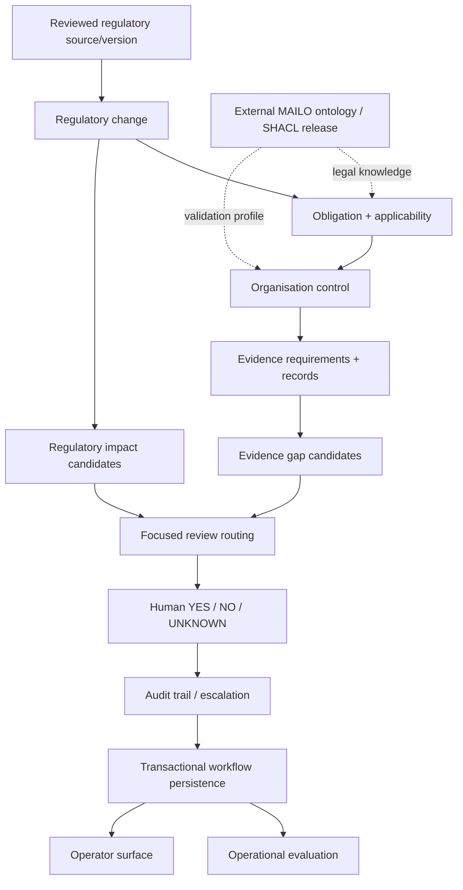

# MAILO Legal AI Engine

**Auditable RegAI workflow engine: regulatory change → controls and evidence → focused human review → durable audit trace.**

[](https://github.com/vrkkao-eng/mailo-legal-ai-engine/actions/workflows/tests.yml)


MAILO Legal AI Engine is an engineering prototype for regulated-AI workflows. It turns reviewed regulatory change data into traceable obligation/control/evidence workflows, routes unresolved issues to focused human review, persists operational state transactionally, records inspectable failure semantics, and exposes both typed APIs and a minimal operator surface.

The core workflow is deliberately inspectable: deterministic logic handles change propagation, supported applicability gates, evidence gaps, routing, idempotency, audit events, and operational evaluation. An optional constrained LLM tool loop can structure supplied source material, but it is not allowed to silently decide regulatory changes, applicability, controls, or legal compliance.

The canonical ontology and substantive legal constraints remain in the separate [MAILO ontology repository](https://github.com/vrkkao-eng/Mailo-ontology); this repository owns the application and workflow layer.

> **Technical reviewers:** see [`docs/technical-review.md`](docs/technical-review.md) for a concise map from common architecture, correctness, evaluation and production-readiness questions to repository evidence.

## What this project demonstrates

| Area | Demonstrated evidence |
| --- | --- |
| **RegAI workflow engineering** | Regulatory change → obligation/applicability → control → evidence → impact/gap → focused human review → audit trail |
| **Backend/API engineering** | FastAPI, typed Pydantic transport schemas, application/domain separation, request IDs, explicit error semantics |
| **Transactional reliability** | SQLite transactions, durable workflow IDs, idempotency keys, forward schema migration, persisted review/audit state |
| **Operational maturity** | Ordered workflow-step events, timing, retryability, stable failure taxonomy, inspectable failed runs |
| **Evaluation** | Deterministic workflow benchmark plus persisted completion/failure, latency and replay-consistency reporting |
| **Operator experience** | Local read-only Regulatory Changes, Review Queue and Case Trace views |
| **CI / packaging** | Python 3.11–3.13 matrix, wheel clean-install smoke test, Docker/Compose health checks, lint/type/coverage quality gate |
| **Knowledge engineering** | RDF/JSON-LD export, reviewed SPARQL, SHACL validation, external canonical MAILO ontology boundary |
| **AI integration** | Optional constrained Anthropic-backed structuring loop; deterministic workflow logic remains inspectable and testable |

## 60-second operator demo

No API key is required.

```bash
git clone https://github.com/vrkkao-eng/mailo-legal-ai-engine.git
cd mailo-legal-ai-engine
docker compose up --build
```

Open `http://localhost:8000/operator` for the local operator surface or `http://localhost:8000/docs` for the typed API.

The operator surface is intentionally small:

- **Regulatory Changes** — durable runs grouped by reviewed regulatory change;
- **Review Queue** — focused human-review work with role and escalation state;
- **Case Trace** — workflow steps, review cases, audit events and failure metadata.

For a terminal-only deterministic workflow demo:

```bash
python -m pip install -c constraints.txt -e ".[dev]"
mailo workflow-demo
```

The older RDF/SHACL demo remains available through `mailo demo`, `mailo graph`, `mailo validate`, and `mailo sparql`.

## Architecture


```mermaid
flowchart TD
    S[Reviewed regulatory source/version] --> C[Regulatory change]
    C --> O[Obligation + applicability]
    O --> K[Organisation control]
    K --> E[Evidence requirements + records]

    E --> G[Evidence gap candidates]
    C --> I[Regulatory impact candidates]
    G --> R[Focused review routing]
    I --> R

    R --> H[Human YES / NO / UNKNOWN]
    H --> A[Audit trail / escalation]
    A --> P[Transactional workflow persistence]
    P --> X[Operational evaluation]
    P --> U[Operator surface]

    M[External MAILO ontology / SHACL release] -. legal knowledge .-> O
    M -. validation profile .-> K
```

The application keeps canonical legal knowledge separate from operational state. Review status, evidence-upload state, workflow timestamps, API metadata and audit events remain in the application layer rather than being pushed into the ontology.

## RegAI v0.5.4

v0.2.x established version-aware regulatory change intelligence and reviewed change benchmarking. v0.3.x added reviewed obligation models, deterministic factual applicability gates, explicit `REVIEW_REQUIRED` abstention, and applicability benchmarking. v0.4.0 introduced reviewed obligation-to-control mappings; v0.4.1 added evidence requirements/records; v0.4.2 added evidence-gap and regulatory-impact candidates; v0.4.3 added selective focused human review and audit trails; v0.4.4 closes the workflow line with a deterministic fixed FRIA scenario and workflow benchmark.

The completed v0.4.x line remains the domain-workflow foundation. v0.5.0 exposed that workflow through typed HTTP schemas and a stateless application service. v0.5.1 added SQLite transactional persistence, v0.5.2 added inspectable workflow execution, and v0.5.3 added persisted operational evaluation. v0.5.4 closes the applicationisation line with a minimal local operator surface for regulatory changes, focused review queues, and auditable case traces.

See [RegAI roadmap](docs/regai-roadmap.md), [Compliance workflow](docs/compliance-workflow.md), [Evidence workflow](docs/evidence-workflow.md), [Workflow impact](docs/workflow-impact.md), [Focused human review](docs/human-review.md), [Workflow evaluation](docs/workflow-evaluation.md), [Workflow API](docs/workflow-api.md), [Workflow persistence](docs/workflow-persistence.md), [Workflow observability](docs/workflow-observability.md), [Operational evaluation](docs/operational-evaluation.md), [Operator surface](docs/operator-surface.md), and [Architecture boundaries](docs/architecture-boundaries.md).

## Implemented now vs next engineering increment

| Implemented now | Next engineering increment |
| --- | --- |
| Python package + CLI | External integrations / deployment maturity (v0.6.x+) |
| FastAPI service layer for offline graph, demo-shape validation, and reviewed SPARQL | Deployment and observability |
| RDF / JSON-LD export | Service configuration and deployment controls |
| Reviewed SPARQL execution | Vector retrieval / Qdrant |
| SHACL validation + structured reports | Adjudicated retrieval evaluation set and metrics |
| Exploratory offline PDF acquisition and source-level lexical baseline | Passage-level citation and abstention evaluation |
| Source-linked findings | Auth / request limits for service use |
| pytest regression tests | Deployment and observability |
| GitHub Actions CI, including container build and `/health` smoke test | Deployment pipeline |
| Docker API image and Compose configuration | Production service hardening |

The right-hand column is a roadmap, **not a claim of current implementation**.

A [candidate retrieval-evaluation seed and offline lexical baseline](docs/retrieval-evaluation-seed.md) cover version-pinned public sources and provisional locators. The baseline is exploratory, source-level only; it is not an adjudicated retrieval benchmark or an API feature.

## Why this problem matters

A legal-AI workflow needs more than a generated answer. It needs to expose:

- which source a finding came from;
- how structured knowledge was produced;
- which explicit constraint was checked;
- what data the check actually evaluated;
- what failed or conformed; and
- where legal interpretation still remains outside the executable layer.

This engine makes those boundaries inspectable instead of collapsing research, model output, and validation into one opaque “compliance” result.

## CLI

Python 3.11+.

```bash
mailo --help
```

Core commands:

| Command | Purpose |
| --- | --- |
| `mailo demo` | Run the bundled synthetic graph/SHACL example offline |
| `mailo workflow-demo` | Run the deterministic RegAI v0.4.4 end-to-end workflow benchmark |
| `mailo graph` | Export supplied findings to JSON-LD and Turtle |
| `mailo validate` | Validate a structured system description against explicit local SHACL shapes |
| `mailo sparql` | Run one of the reviewed packaged SELECT queries |
| `mailo research` | Optional live provider-backed structuring of supplied source material |

Exit status is 0 for success/conformance, 1 for nonconformance or a reported processing error, and 2 for command-line usage errors.

Demo shapes are synthetic engineering examples, not legal rules.

## HTTP service (local development)

The service is an optional, local API adapter over the same graph export, SHACL,
and reviewed-query functions used by the CLI. It does not expose `/research`.

```bash
python -m pip install -c constraints.txt -e ".[service]"
uvicorn mailo_cli.api:app --reload
# or: docker compose up --build
```

It exposes `GET /health`, `GET /ready`, the graph/validation/query endpoints, durable workflow APIs, `GET /workflow/operations/report`, and a local operator surface at `GET /operator`. The operator page reads `/operator/api/changes`, `/operator/api/reviews`, and `/operator/api/cases/{run_id}`. Interactive request schemas are available at `/docs` when the
local service is running. `/validate` defaults to the packaged synthetic `demo`
profile. It may also use an operator-registered external profile, but is not an
endpoint for arbitrary remote or user-supplied SHACL rules. `/sparql` similarly
accepts only a named packaged reviewed query. These constraints preserve the
existing validation boundary and avoid presenting the service as a
general-purpose query or rule-execution host.

To register a trusted external shapes release, place the shapes file and a
manifest in the same directory, pin its SHA-256, then set
`MAILO_SHAPES_MANIFEST` before starting the API:

```json
{
  "profiles": {
    "mailo-ontology-vX.Y.Z": {
      "file": "mailo_shacl_shapes.ttl",
      "sha256": "<64 lowercase hexadecimal characters>",
      "scope": "Conformance to the selected MAILO shapes release; not a legal compliance determination"
    }
  }
}
```

Profile names are the only shape selection the API accepts. The referenced
file must remain beside the manifest and match its SHA-256 on every request.
The validation response records the selected profile and shape hash. A shapes
release is trusted because an operator has registered and pinned it; this does
not make its conformance result a legal conclusion.

`POST /workflow/evaluate` remains stateless. Durable workflow creation is available through `POST /workflow/runs` with an `Idempotency-Key` header. SQLite storage defaults to `artifacts/workflow.db` and can be changed with `MAILO_WORKFLOW_DB`.

Compose mounts a named volume at `/data` and defaults `MAILO_WORKFLOW_DB` to `/data/workflow.db`, so local workflow state survives container replacement. The container setup still does not include authentication/RBAC, external telemetry, rate limits, PostgreSQL/HA, Qdrant, or a vector database.

The supplied `.env.example` leaves `MAILO_WORKFLOW_DB` unset so a copied `.env`
retains that Compose default. Direct local Python runs still default to
`artifacts/workflow.db`; a custom container path must be inside a writable,
persistent mount.

The image runs the installed wheel as UID/GID `10001:10001`, with a digest-pinned
Python base and constrained runtime dependencies. Compose publishes port 8000
on `127.0.0.1` only. New named volumes inherit the writable `/data` ownership;
existing volumes or bind mounts may need an explicit ownership adjustment after
backup. See [runtime operations](docs/runtime-operations.md) for the tested
contract, dependency refresh and existing-volume instructions.

### API runtime controls

The service defaults to a 1 MiB actual request-body limit, a 30-second
request deadline, and no CORS origins. It returns a generated `X-Request-ID`,
adds basic browser-safety response headers, and emits a JSON access-log event
with method, path, status, and duration. Configure the controls through
environment variables (or Compose):

| Variable | Default | Purpose |
| --- | --- | --- |
| `MAILO_MAX_REQUEST_BYTES` | `1048576` | Maximum actual request body, including chunked input (up to 10 MiB) |
| `MAILO_REQUEST_TIMEOUT_SECONDS` | `30` | Request deadline (up to 300 seconds) |
| `MAILO_CORS_ORIGINS` | empty | Comma-separated, explicit browser origins; empty disables CORS |
| `MAILO_WORKFLOW_DB` | `artifacts/workflow.db` | SQLite file used for durable workflow runs/reviews/audit records |

Bodies are read in bounded form before JSON parsing or domain work. The service
rejects excess declared or actual bytes with 413, and invalid/duplicate length
headers or a declared/actual length mismatch with 400. These responses retain
request IDs, safety headers and JSON access events. The deadline includes body
intake; HTTP framing remains the ASGI server's responsibility.

The deadline protects the HTTP response path but does not turn RDFLib or
pySHACL into a resource sandbox; use trusted local shapes and deploy with
appropriate process-level CPU/memory limits.

## Using the public MAILO ontology

Keep the application and ontology releases separate:

```bash
git clone --branch v5.2.3 --depth 1 \
  https://github.com/vrkkao-eng/Mailo-ontology.git \
  external/Mailo-ontology

mailo sparql \
  --ontology external/Mailo-ontology/docs/ontology.ttl \
  --built-in frameworks

mailo sparql \
  --ontology external/Mailo-ontology/docs/ontology.ttl \
  --built-in cjeu_chain

mailo validate \
  --instance mailo_cli/resources/system.json \
  --shapes external/Mailo-ontology/docs/mailo_shacl_shapes.ttl \
  --output artifacts/mailo-validation
```

The deliberately minimal demo system can fail the substantive MAILO shapes. Conformance is always relative to the supplied shapes and their selected targets.

Other packaged query names are `tensions`, `obligations_samd`, and `fto_patent`. The inherited `obligations_samd` template currently returns zero rows against ontology v5.2.3; it is **not** an implemented applicability/reasoning engine. Query execution evidence is documented in [verification](docs/verification.md).

## Optional live LLM tool loop

```bash
python -m pip install -c constraints.txt -e ".[research]"

# Set ANTHROPIC_API_KEY and MAILO_MODEL in your shell
mailo research \
  --input mailo_cli/resources/findings.json \
  --output artifacts/research
```

The public research command:

- requires an explicitly selected model;
- sends only supplied text and source URLs to Anthropic;
- can call only the public `save_finding` tool;
- cannot browse;
- cannot read arbitrary local files; and
- accepts only source URLs included in the supplied input.

Live model use may incur provider charges. Mocked tests do not establish model quality.

## Validation and testing

```bash
python -m pytest -q
python tools/validate_examples.py
python -m build --wheel
```

Regression coverage includes:

- source provenance;
- model/tool round trips;
- incomplete model responses;
- RDF escaping;
- strict JSON booleans;
- duplicate titles;
- full-content export;
- anonymous SHACL constraints;
- SHACL severity levels;
- CLI exit codes; and
- packaged SPARQL queries.

Development and CI installs use `-c constraints.txt` with the desired extras.
Raw ASGI regression cases cover chunked body limits, boundary sizes, malformed
length headers, disconnects and upload deadlines. The container CI also verifies
the non-root installed package and actual loopback HTTP behavior.

A test fixture removes live credentials and rejects external socket connections. GitHub Actions runs the suite on Python 3.11, 3.12, and 3.13, builds a wheel, installs it into a clean environment outside the checkout, and smoke-tests the installed CLI.

Each validation report records SHA-256 hashes of the input instance and shapes file so the exact checked inputs remain identifiable.

## Knowledge-engineering decisions

- Canonical vocabulary namespace: `https://w3id.org/mailo#`.
- Finding categories map to RDF types, with source links and content preserved.
- Content-derived identifiers prevent different same-title findings from overwriting one another.
- System JSON uses explicit class names, strict booleans, and linked oversight/explanation records.
- Missing assertions stay missing; the builder does not invent positive oversight flags.
- Reviewed SPARQL templates are packaged with the application.
- The runtime uses RDFLib and pySHACL; it does not rebuild or duplicate the canonical ontology.

## Relation to the MAILO ontology

| Repository | Owns |
| --- | --- |
| [Mailo-ontology](https://github.com/vrkkao-eng/Mailo-ontology) | Canonical RDF/OWL model, substantive SHACL shapes, legal-source annotations, releases; CC BY 4.0 |
| **mailo-legal-ai-engine** | CLI, optional research tool loop, input mapping, graph export, validation reports, SPARQL execution, tests; MIT |

The engine versioning is independent of the private CLI and ontology release numbering; **v0.5.4** closes the v0.5.x applicationisation line with a minimal operator-facing change/review/case-trace surface after the completed v0.2.x change-intelligence and v0.3.x applicability increments. Ontology files remain external and retain their own licence. No private Git history was copied.

## Limitations

This is an **engineering prototype**, not a production service.

There is currently:

- no deployed API service (the repository includes a local/container API only);
- no PostgreSQL or production HA persistence layer;
- no authentication/RBAC for the local operator surface;
- no vector database;
- no retrieval benchmark;
- no independent legal validation; and
- no production-readiness claim.

SHACL conformance is not legal correctness or a compliance decision. Constraints check asserted data and selected targets; an irrelevant target class can produce vacuous conformance. Only trusted local shapes should be executed. The engine disables JavaScript, advanced rules, and ontology imports, but shape/query resource exhaustion is not sandboxed.

The LLM can still misinterpret supplied text. A matching source URL proves provenance membership, not evidential support. The private project's specialist prompts, web-retrieval integrations, and multi-agent orchestrator are not part of this public release.

Category mappings are application conventions; they do not establish that a finding is a court holding. The patent query juxtaposes cases and tensions without establishing a case-specific legal relationship and is not a freedom-to-operate assessment. Ontology versions can change legal assertions and shapes independently of engine versions.

## Engineering profile and roadmap

See [Engineering profile](docs/engineering-profile.md) for the recruiter/FDE-oriented engineering evidence. The RegAI evolution is documented separately in [RegAI roadmap](docs/regai-roadmap.md), with repository ownership fixed in [Architecture boundaries](docs/architecture-boundaries.md).

## Attribution

Victor (Chang-Hua) Kao's original source declares MIT licensing and records Claude-assisted development. This extraction and its new tests/documentation were prepared with Codex assistance.

See:

- [ATTRIBUTION.md](ATTRIBUTION.md) for file-level provenance;
- [PUBLICATION_AUDIT.md](PUBLICATION_AUDIT.md) for the public-extraction audit; and
- [docs/verification.md](docs/verification.md) for query/validation verification notes.
